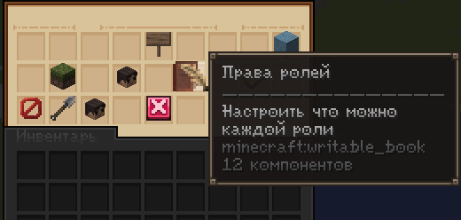
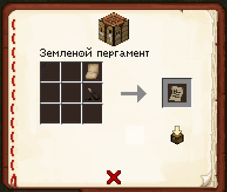
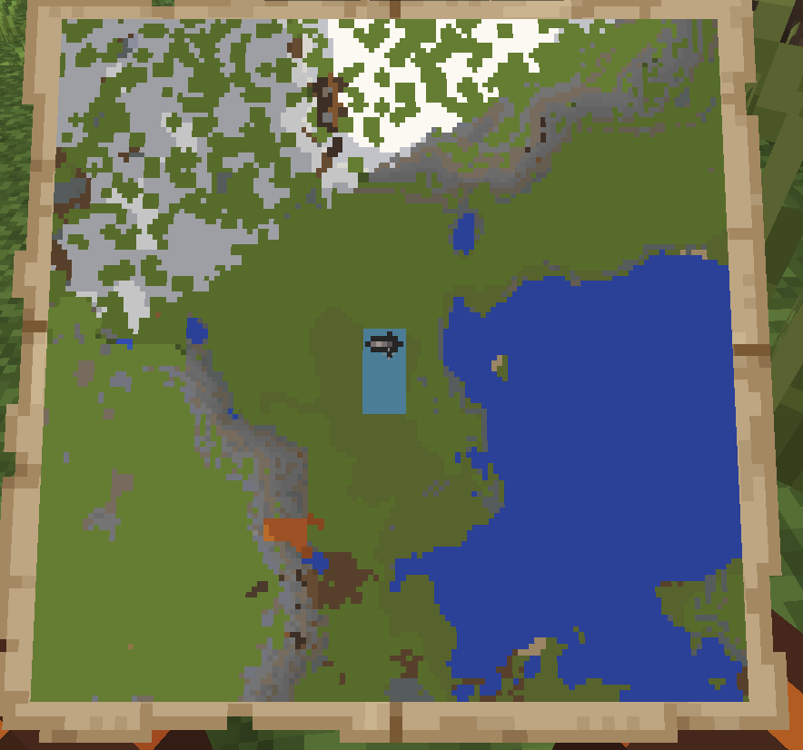

# Наделы

Помимо города как общей территории, у каждого игрока может быть **личная земля внутри города** — надел. Это уже не собственность города, а собственность конкретного жителя.

## Что такое Надел

**Надел** — это личный участок земли внутри города, который принадлежит игроку, а не городу в целом.

На своём наделе игрок может:

- Устанавливать **тип чанка** — определять, для чего используется эта земля
- Настраивать **разрешения для крестьян**, которых он принял на свой надел — кому что можно делать на его территории

!!! note "Надел ≠ город"
    Надел — это ваша личная территория внутри города. Тип чанка и разрешения для крестьян настраиваете вы сами, а не мэр или советники города.

## Земляной пергамент

Чтобы отметить участок под будущий надел, понадобится специальный предмет — **Земляной пергамент**.

- Земляной пергамент **крафтится** — это не покупной и не выдаваемый предмет
- Используется для того, чтобы отметить границы участка на специальной карте

## Как получить надел

1. Скрафтите **Земляной пергамент**
2. Используйте его, чтобы отметить нужный участок земли на специальной карте
3. Обратитесь к **мэру города** и обсудите с ним условия получения надела
4. После того как условия согласованы — надел закрепляется за вами

!!! warning "Последнее слово — за мэром"
    Отметить землю на карте может **любой игрок**, но окончательное решение о выдаче надела и его условиях принимает мэр города. Отметка на карте — это заявка, а не автоматическое получение земли.

!!! tip "Обсуждайте условия заранее"
    Прежде чем крафтить пергамент и отмечать конкретный участок, стоит заранее поговорить с мэром — какие условия он обычно ставит, свободна ли выбранная земля и нет ли на неё других претендентов.

## Управление наделом

После получения надела вы можете:

**Настроить тип чанка**
: Определяет назначение вашей земли внутри надела.

**Настроить разрешения для крестьян**
: Крестьяне — это жители, которых вы лично приняли на свой надел. Вы решаете, что им разрешено делать на вашей территории, а что — нет.

!!! note "Крестьяне надела — не советники города"
    Разрешения, которые вы выдаёте крестьянам на своём наделе, касаются только вашей личной территории и не связаны с ролями советников города (Регент, Канцлер, Генерал, Дипломат).

---

!!! tip "Совет от старожилов"
    Не отмечайте участок наугад — уточните у мэра, какие зоны города уже заняты под другие наделы или общественные постройки, чтобы не пришлось потом переделывать границы.