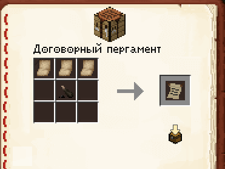
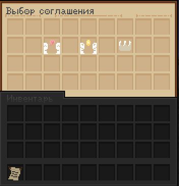
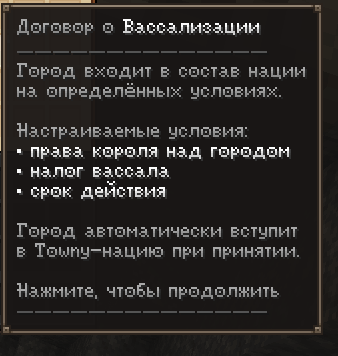
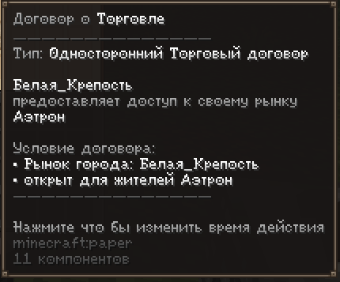
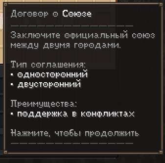

# Договоры

Города не живут в изоляции — с соседями можно дружить, торговать, объединяться против общих врагов или входить в состав более крупного государства. Всё это оформляется через **договоры**.

## Кто может заключать договоры

Предложить или подписать договор от имени города может только игрок с одной из трёх ролей:

- **Мэр** (глава города)
- **Регент**
- **Дипломат**

!!! note "Почему именно эти роли"
    Договор — это официальное решение города, а не личное мнение одного жителя. Поэтому право вести переговоры есть только у тех, кому глава лично делегировал такие полномочия — либо у самого главы.

!!! warning "Обе стороны должны соответствовать"
    Заключить договор можно только с игроком, у которого в **другом городе** тоже есть роль Мэра, Регента или Дипломата. Обычный житель — даже самый активный — заключать договоры от лица города не может.

## Как заключить договор

1. Убедитесь, что у вас есть роль **Мэра**, **Регента** или **Дипломата**
2. Получите предмет **«Договорной пергамент»**
3. Найдите представителя другого города — тоже Мэра, Регента или Дипломата
4. Нажмите пергаментом на этого игрока — откроется меню заключения договора

5. Выберите нужный вид договора и, если требуется, укажите условия

6. Дождитесь, пока вторая сторона подтвердит договор — без согласия оппонента договор не вступит в силу

!!! note "Договорной пергамент"
    Без этого предмета меню договора не откроется, даже если у вас есть нужная роль. Обычный правый клик или взаимодействие с игроком без пергамента ничего не даст.

!!! tip "Переговоры — это тоже часть игры"
    Перед тем как подойти с готовым предложением, обсудите условия заранее — в личных сообщениях или голосом. Договор, который обе стороны обсудили заранее, подписывается быстрее и реже вызывает конфликты.

## Виды договоров

-   :material-flag-checkered:{ .lg .middle } **Вассализация**

    ---

    Позволяет ненасильственно присоединить город к более крупному государству. Стороны сами прописывают условия вассалитета — что обязан делать вассал и что взамен даёт сюзерен.

    

-   :material-cart-arrow-right:{ .lg .middle } **Торговый союз**
    ---
    Соединяет рынки двух городов — жителям становится проще обмениваться товарами и ресурсами между городами.
    
-   :material-shield-account:{ .lg .middle } **Союз**

    ---
    Позволяет жителям союзного города вступать в вашу армию во время войны — это взаимная военная поддержка.
    

### Коротко в таблице

| Договор | Что делает |
|---------|------------|
| **Вассализация** | Присоединяет город к государству на прописанных условиях, без войны |
| **Торговый союз** | Объединяет рынки городов |
| **Союз** | Жители союзника могут вступать в вашу армию во время войны |

## Вассализация: на что обратить внимание

Вассализация — самый серьёзный из договоров, поэтому к нему стоит отнестись внимательнее остальных.

- Условия вассалитета **прописываются сторонами вручную** — не бывает двух одинаковых договоров
- Расторжение вассалитета обычно сложнее, чем его заключение — уточняйте условия выхода **до** подписания, а не после

*(здесь будет скриншот примера прописанных условий вассалитета)*

!!! warning "Читайте условия до подписания"
    После того как вторая сторона подтвердила договор, он вступает в силу немедленно. Внимательно проверяйте условия — особенно в Вассализации — прежде чем соглашаться.

---

!!! tip "Совет от старожилов"
    Не подписывайте Союз или Вассализацию с городом, который вы плохо знаете, только потому что вам предложили выгодные условия. Договор — это долгосрочные обязательства, а не разовая сделка.