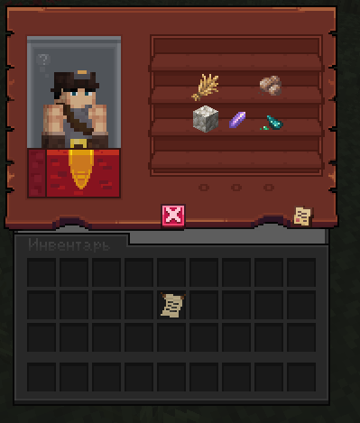
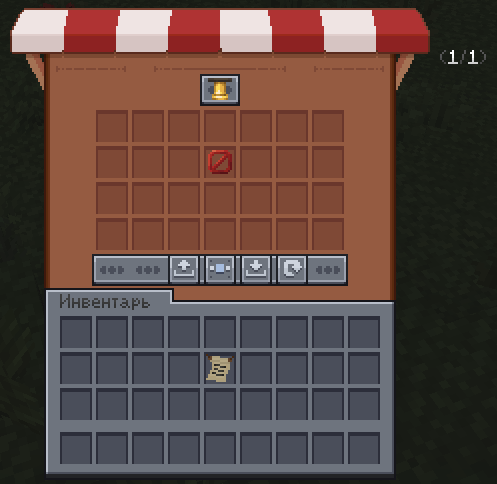

# Экономика

Помимо казны города и налогов, у игроков есть отдельная система торговли — **рынок**. Она завязана на постройке «Рынок» (см. страницу «Особые здания») и даёт доступ к двум инструментам: скупщику и аукциону.

## Регион «Рынок»


Внутри этого региона доступны две команды:
```
/shop
/ah
```

!!! note "Без постройки — нет региона"
    Пока в городе не зарегистрирован Рынок, доступа к региону и командам `/shop` и `/ah` нет.

## `/shop` — скупщик

Скупщик — это NPC, который покупает у игроков предметы за престиж.

- **Количество предметов**, которые скупщик готов принять, зависит от **уровня Рынка** в городе — чем выше уровень, тем больше слотов для скупки
- Набор предметов **случайный** — какие именно вещи скупщик готов покупать сегодня, заранее неизвестно
- **Цены обновляются раз в сутки** — то, что было выгодно продать вчера, сегодня может стоить дешевле (или дороже)



!!! warning "Нужен ранг «Торговец»"
    Чтобы продавать предметы через `/shop`, у игрока должен быть ранг **Торговец**. Без этого ранга скупщик не примет товар, даже если слоты свободны.

!!! tip "Проверяйте цены каждый день"
    Раз в сутки цены меняются, поэтому не стоит копить весь товар «на потом» — иногда выгоднее продать сразу, пока цена высокая, а не ждать неделю.

## `/ah` — аукцион

`/ah` открывает **аукцион** — площадку для торговли предметами напрямую между игроками, без посредника-скупщика.

По умолчанию у каждого города свой отдельный рынок. Но он может **объединиться** с рынком другого города в двух случаях:

- город заключил **Торговый союз** (см. страницу «Договоры») с другим городом
- город вошёл в состав **единого государства** (например, стал частью нации или протектората)

В обоих случаях рынки объединяются, и игроки из разных городов получают возможность **торговать друг с другом через общий аукцион**, а не только внутри своего города.



!!! note "Чем полезно объединение рынков"
    Больше игроков на одном аукционе — больше предложений и выше шанс быстро продать или найти нужный предмет. Это одна из практических причин заключать Торговые союзы даже с городами, с которыми нет военных договорённостей.

